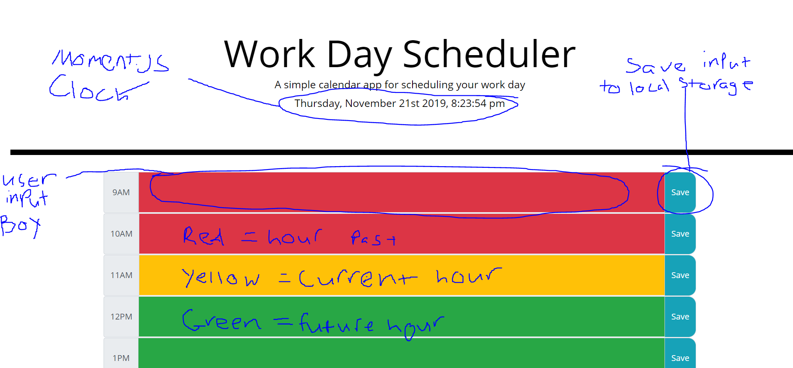

# day-planner
DEPLOYED LINK:
https://claudegarcia.github.io/day-planner/

UI FEATURES AND INPUT BOX COLOR CODE:

APP LOGIC.FUNCTION
app works by importing moment.js for clock
-depending on hour of the day, input boxes change color
    -upcoming hours are highlighted green
    -current hour is highlighted yellow
    -past hours are highlighted red

    -after 6pm, all boxes are highlighted green to plan for next day

-input boxes are linked to save button which saves input value to local storage and updates innerHTML to saved value on page reload.
-input will not remain after page load if save button is not clicked
-to clear input box, delete all text and save

